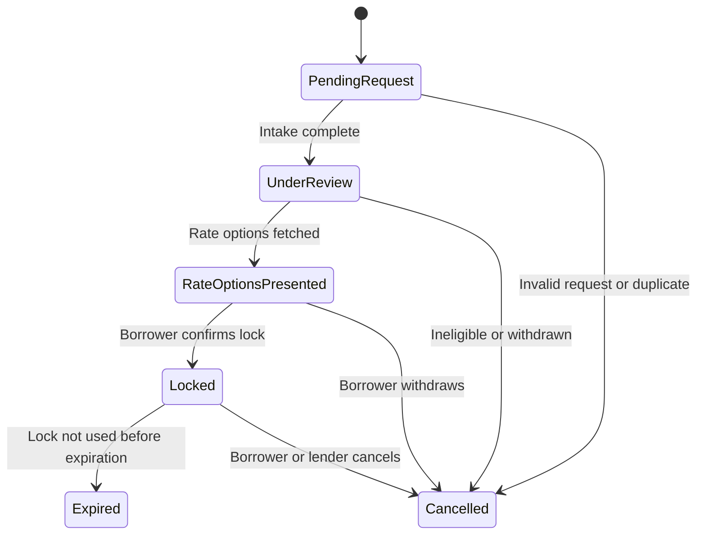
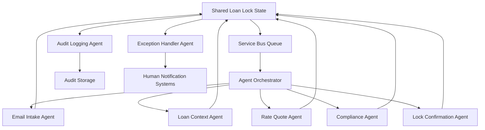

# AI Rate Lock Agents

## Project Purpose

This project implements a multi-agent AI system designed to automate the mortgage rate lock process, reducing manual intervention and accelerating loan processing workflows. The system handles approximately 1,000 rate lock requests per week, automatically progressing requests through their lifecycle and identifying cases that require human attention.

## Problem Statement

Traditional mortgage rate lock processing involves multiple manual steps where requests often get stuck waiting for human analysis and intervention. This creates bottlenecks in the loan origination process and delays closing timelines for borrowers.

## Solution Overview

The AI Rate Lock Agents system uses **Semantic Kernel (SK)** to create autonomous agents that monitor rate lock requests and automatically progress them through completion. Each agent has specialized responsibilities and works collaboratively to move requests forward.

## System Architecture

### Multi-Agent Design

The system consists of seven specialized agents that replicate the normal human-led process:

## 📧 **Email Intake Agent** (`EmailIntakeAgent`)
**Primary Role**: First point of contact for rate lock requests via email

**Key Responsibilities**:
- **Inbox Monitoring**: Continuously monitors designated email inbox for new rate lock requests
- **Email Parsing**: Extracts structured data from unstructured email content using NLP techniques
- **Data Extraction**: Identifies and captures:
  - Borrower name and contact information
  - Loan application ID references
  - Property address details
  - Requested lock terms and preferences
- **Identity Validation**: Verifies sender email matches known borrower records in the system
- **Acknowledgment Communications**: Sends immediate confirmation emails to borrowers upon receipt

**Behavioral Patterns**:
- Operates on a polling schedule to check for new emails
- Uses semantic analysis to understand varying email formats and language
- Maintains a whitelist/blacklist for sender validation
- Escalates suspicious or unverifiable requests
- Creates initial `PendingRequest` status loan lock records

---

## 🏦 **Loan Application Context Agent** (`LoanApplicationContextAgent`)
**Primary Role**: Loan origination system integration and validation

**Key Responsibilities**:
- **LOS Integration**: Connects with Loan Origination Systems (Encompass, Blend, etc.)
- **Data Retrieval**: Fetches comprehensive loan application data including:
  - Borrower financial information and credit details
  - Property information and appraisal status
  - Loan terms, amount, and product type
  - Current processing status and milestones
- **Eligibility Validation**: Confirms rate lock eligibility based on:
  - Loan processing stage (pre-approved, underwritten, etc.)
  - Required documentation completion status
  - Income and asset verification status
  - Credit approval and conditions
- **Context Enrichment**: Provides complete loan context to downstream agents

**Behavioral Patterns**:
- Validates borrower identity by cross-referencing email with loan records
- Checks for blocking conditions before allowing rate lock progression
- Maintains data freshness by re-querying LOS for updated information
- Transitions loan locks from `PendingRequest` to `UnderReview` upon successful validation

---

## 💰 **Rate Quote Agent** (`RateQuoteAgent`)
**Primary Role**: Pricing engine integration and rate option generation

**Key Responsibilities**:
- **Pricing Engine Integration**: Connects with pricing systems (Optimal Blue, MCT Trading, Polly)
- **Rate Option Generation**: Produces multiple rate lock options with varying:
  - Interest rates and points combinations
  - Lock term durations (30, 45, 60+ days)
  - Product variations and special programs
- **Financial Calculations**: Computes monthly payments, APRs, and total loan costs
- **Timeline Optimization**: Recommends optimal lock terms based on estimated closing dates
- **Special Programs**: Identifies available options like:
  - Float-down capabilities for rate improvements
  - Lock-and-shop programs for purchase transactions
  - Extended lock terms for complex scenarios

**Behavioral Patterns**:
- Refreshes rate quotes periodically due to market volatility (typically 4-hour expiration)
- Considers LTV ratios, credit scores, and loan characteristics for accurate pricing
- Provides tiered options from conservative to aggressive pricing strategies
- Transitions loan locks from `UnderReview` to `RateOptionsPresented`

---

## ⚖️ **Compliance & Risk Agent** (`ComplianceRiskAgent`)
**Primary Role**: Regulatory compliance and risk management

**Key Responsibilities**:
- **Regulatory Compliance**: Ensures adherence to:
  - TRID (Truth in Lending/Real Estate Settlement) requirements
  - State-specific lending regulations
  - Federal lending guidelines and consumer protection laws
- **Disclosure Management**: Validates presence and timeliness of:
  - Initial Loan Estimates
  - Rate Lock Disclosure forms
  - Truth in Lending statements
  - Good Faith Estimates
- **Risk Assessment**: Evaluates:
  - Lock timing against closing schedules
  - Fee reasonableness and competitive positioning
  - Borrower capacity and debt-to-income ratios
  - Property and collateral adequacy
- **Exception Identification**: Flags potential issues requiring human review

**Behavioral Patterns**:
- Performs comprehensive validation before allowing rate lock execution
- Generates detailed compliance reports with pass/fail/warning statuses
- Automatically generates missing disclosures when possible
- Escalates FAIL status items to exception handling
- Allows WARNING status items to proceed with notation

---

## 🔒 **Lock Confirmation Agent** (`LockConfirmationAgent`)
**Primary Role**: Rate lock execution and confirmation management

**Key Responsibilities**:
- **Lock Execution**: Submits confirmed rate selections to pricing engines
- **System Updates**: Records lock details in:
  - Loan Origination Systems
  - Internal tracking databases
  - Pricing engine lock registries
- **Document Generation**: Creates professional rate lock confirmation documents
- **Stakeholder Communication**: Sends confirmations to:
  - Borrowers with rate protection details
  - Loan officers with processing instructions
  - Operations teams with timeline requirements
- **Status Management**: Transitions loan locks to final `Locked` status

**Behavioral Patterns**:
- Validates all prerequisite approvals before execution
- Creates immutable lock records with expiration tracking
- Implements retry logic for system integration failures
- Maintains detailed confirmation audit trails
- Sets up automatic expiration monitoring and alerts

---

## 📋 **Audit & Logging Agent** (`AuditLoggingAgent`)
**Primary Role**: Compliance documentation and performance monitoring

**Key Responsibilities**:
- **Comprehensive Logging**: Records all system activities including:
  - Individual agent actions and outcomes
  - State transitions with timestamps
  - Error events and resolution attempts
  - Compliance check results and findings
- **Audit Trail Generation**: Creates complete chronological records for:
  - Regulatory compliance audits
  - Internal quality assurance reviews
  - Performance analysis and optimization
- **SLA Monitoring**: Tracks key performance indicators:
  - Processing time by state and overall
  - Agent performance and success rates
  - Exception frequency and resolution times
- **Reporting**: Generates detailed reports for management and compliance teams

**Behavioral Patterns**:
- Operates continuously alongside all other agents
- Implements secure, tamper-proof logging mechanisms
- Provides real-time dashboards and alerting
- Archives historical data for trend analysis
- Enables drill-down investigation of specific cases

---

## 🚨 **Exception Handler Agent** (`ExceptionHandlerAgent`)
**Primary Role**: Human escalation and complex case management

**Key Responsibilities**:
- **Exception Classification**: Categorizes issues by:
  - Priority level (High, Medium, Low)
  - Complexity requirements (Standard, Complex, Specialist-required)
  - Business impact (Blocking vs. Non-blocking)
- **Intelligent Routing**: Directs cases to appropriate staff:
  - Loan officers for standard borrower issues
  - Compliance specialists for regulatory matters
  - Pricing specialists for rate anomalies
  - Technical support for system problems
- **Escalation Management**: Coordinates human intervention through:
  - Email notifications with detailed context
  - SMS alerts for high-priority cases
  - Slack/Teams integration for team awareness
- **Resolution Tracking**: Monitors escalated cases until completion

**Behavioral Patterns**:
- Automatically triggers on predefined exception conditions
- Provides comprehensive context and recommended actions to human reviewers
- Implements escalation hierarchies (loan officer → supervisor → specialist)
- Tracks resolution times against SLA targets
- Learns from escalation patterns to improve automatic processing

---

## 🔄 **Agent Interaction Patterns**

**Sequential Processing**: Agents typically operate in sequence:
1. EmailIntakeAgent → 2. LoanApplicationContextAgent → 3. RateQuoteAgent → 4. ComplianceRiskAgent → 5. LockConfirmationAgent

**Parallel Support**: AuditLoggingAgent and ExceptionHandlerAgent operate continuously alongside primary agents

**Shared Memory**: All agents read/write to shared loan lock state, enabling coordination without direct coupling

**Error Recovery**: Any agent can invoke ExceptionHandlerAgent when encountering unresolvable issues

## Rate Lock Lifecycle States

The system manages rate locks through the following states:



### State Descriptions

- **PendingRequest**: Email received, awaiting processing
- **UnderReview**: Loan and borrower eligibility being validated
- **RateOptionsPresented**: Lock options presented to borrower
- **Locked**: Lock confirmed and executed
- **Expired**: Lock expired before use
- **Cancelled**: Lock cancelled at any stage

## Data Model

The system uses a comprehensive JSON entity structure to represent loan locks at different stages:

### Core Entity Fields

- **loanLockId**: Unique identifier for the rate lock
- **loanApplicationId**: Reference to the loan application
- **borrower**: Contact and identification information
- **property**: Property details and occupancy type
- **lockDetails**: Rate, terms, expiration, and lock metadata
- **compliance**: Regulatory checks and fee information
- **audit**: Action history and agent attribution
- **notifications**: Communication tracking

### Field Population by State

Different fields are populated as the rate lock progresses through its lifecycle, enabling agents to understand what actions are needed at each stage.

## Agent Communication Model

### **Shared State Architecture**
All agents operate on a shared loan lock entity stored in persistent storage (Azure Cosmos DB/Table Storage). This eliminates the need for complex inter-agent messaging while maintaining state consistency.

### **Event-Driven Coordination** 
- **Azure Service Bus**: Triggers agent actions based on state changes
- **Message Types**:
  - `new_request`: Triggers EmailIntakeAgent processing
  - `context_retrieved`: Activates RateQuoteAgent
  - `rates_presented`: Initiates ComplianceRiskAgent validation
  - `compliance_passed`: Triggers LockConfirmationAgent execution
  - `exception_occurred`: Activates ExceptionHandlerAgent escalation

### **Coordination Patterns**

#### **Primary Processing Flow**
```
EmailIntake → LoanContext → RateQuote → Compliance → LockConfirmation
```

#### **Continuous Support Agents**
- **AuditLoggingAgent**: Logs every agent action and state transition
- **ExceptionHandlerAgent**: Monitors for failure conditions and escalates as needed

#### **Retry and Recovery**
- Failed agent actions trigger automatic retries with exponential backoff
- After retry exhaustion, ExceptionHandlerAgent creates human escalation cases
- State rollback capabilities for critical failures

#### **Parallel Processing**
- Multiple loan locks can be processed simultaneously
- Agents use optimistic locking to prevent concurrent modification conflicts
- Queue-based load balancing distributes work across agent instances

### **Data Flow Architecture**



## Technology Stack

- **Semantic Kernel (SK)**: AI orchestration and planning framework
- **Python**: Primary development language
- **Azure Container Apps**: Deployment platform (monolithic architecture)
- **Azure Service Bus**: Message queuing and agent coordination
- **Azure Cosmos DB**: Primary data storage for rate lock records
- **Azure Redis**: Agent memory and context storage
- **Azure Application Insights**: Logging and monitoring

## Project Structure

```
/ai-rate_lock_agents/
├── README.md                       # Project documentation
├── copilot.chat                    # Original design conversation
├── /agents/                        # Core agent implementations
│   ├── email_intake_agent.py       # Email monitoring and parsing
│   ├── loan_context_agent.py       # LOS integration and validation
│   ├── rate_quote_agent.py         # Pricing engine integration
│   ├── compliance_risk_agent.py    # Regulatory compliance validation
│   ├── lock_confirmation_agent.py  # Rate lock execution
│   ├── audit_logging_agent.py      # Audit trail and logging
│   └── exception_handler_agent.py  # Human escalation management
├── /models/                        # Data structures
│   └── loan_lock.py                # Rate lock entity model (basic)
├── /orchestrator/                  # Agent coordination
│   └── orchestrator.py             # Task routing logic (stub)
├── /planners/                      # Agent decision logic
│   └── lock_progression_planner.py # Action planning prompts
└── /utils/                         # Shared utilities
    └── logger.py                   # Basic logging utilities (stub)
```

### Implementation Status
- ✅ **Core Agents**: All 7 agents fully implemented with comprehensive functionality
- ⚠️ **Data Models**: Basic structure in place, needs enhancement to match JSON schema
- ⚠️ **Orchestrator**: Stub implementation, needs full coordination logic
- ⚠️ **Configuration**: Not yet implemented, needs environment and service configuration
- ⚠️ **Service Integrations**: Mock implementations in place, ready for external service connections

## Benefits

- **Reduced Processing Time**: Automated progression eliminates manual bottlenecks
- **Improved Accuracy**: Consistent rule application and validation
- **Enhanced Compliance**: Complete audit trail and regulatory adherence
- **Scalability**: Handles high request volumes with auto-scaling
- **Cost Efficiency**: Reduces manual labor costs and processing errors
- **Better Customer Experience**: Faster response times and proactive communication

## Getting Started

*(Implementation details to be added as development progresses)*

## Contributing

*(Contributing guidelines to be defined)*

## License

*(License information to be determined)*