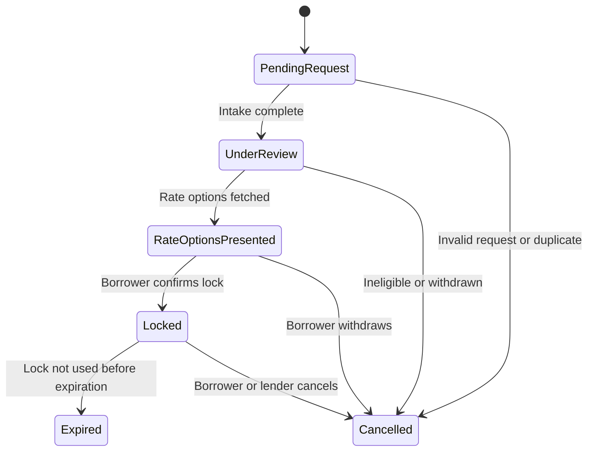
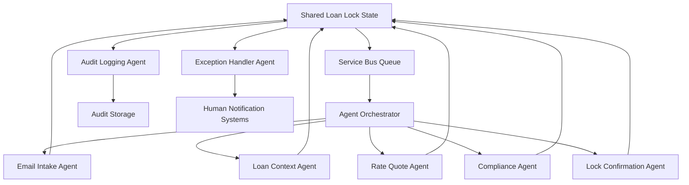

# AI Rate Lock Agents

## Project Purpose

This project implements a multi-agent AI system designed to automate the mortgage rate lock process, reducing manual intervention and accelerating loan processing workflows. The system handles approximately 1,000 rate lock requests per week, automatically progressing requests through their lifecycle and identifying cases that require human attention.

## Problem Statement

Traditional mortgage rate lock processing involves multiple manual steps where requests often get stuck waiting for human analysis and intervention. This creates bottlenecks in the loan origination process and delays closing timelines for borrowers.

## Solution Overview

The AI Rate Lock Agents system uses **Semantic Kernel (SK)** to create autonomous agents that monitor rate lock requests and automatically progress them through completion. Each agent has specialized responsibilities and works collaboratively to move requests forward.

## System Architecture

### Multi-Agent Design

The system consists of seven specialized agents that replicate the normal human-led process:

## 📧 **Email Intake Agent** (`EmailIntakeAgent`)
**Primary Role**: First point of contact for rate lock requests via email

**Key Responsibilities**:
- **Inbox Monitoring**: Continuously monitors designated email inbox for new rate lock requests
- **Email Parsing**: Extracts structured data from unstructured email content using NLP techniques
- **Data Extraction**: Identifies and captures:
  - Borrower name and contact information
  - Loan application ID references
  - Property address details
  - Requested lock terms and preferences
- **Identity Validation**: Verifies sender email matches known borrower records in the system
- **Acknowledgment Communications**: Sends immediate confirmation emails to borrowers upon receipt

**Behavioral Patterns**:
- Operates on a polling schedule to check for new emails
- Uses semantic analysis to understand varying email formats and language
- Maintains a whitelist/blacklist for sender validation
- Escalates suspicious or unverifiable requests
- Creates initial `PendingRequest` status loan lock records

---

## 🏦 **Loan Application Context Agent** (`LoanApplicationContextAgent`)
**Primary Role**: Loan origination system integration and validation

**Key Responsibilities**:
- **LOS Integration**: Connects with Loan Origination Systems (Encompass, Blend, etc.)
- **Data Retrieval**: Fetches comprehensive loan application data including:
  - Borrower financial information and credit details
  - Property information and appraisal status
  - Loan terms, amount, and product type
  - Current processing status and milestones
- **Eligibility Validation**: Confirms rate lock eligibility based on:
  - Loan processing stage (pre-approved, underwritten, etc.)
  - Required documentation completion status
  - Income and asset verification status
  - Credit approval and conditions
- **Context Enrichment**: Provides complete loan context to downstream agents

**Behavioral Patterns**:
- Validates borrower identity by cross-referencing email with loan records
- Checks for blocking conditions before allowing rate lock progression
- Maintains data freshness by re-querying LOS for updated information
- Transitions loan locks from `PendingRequest` to `UnderReview` upon successful validation

---

## 💰 **Rate Quote Agent** (`RateQuoteAgent`)
**Primary Role**: Pricing engine integration and rate option generation

**Key Responsibilities**:
- **Pricing Engine Integration**: Connects with pricing systems (Optimal Blue, MCT Trading, Polly)
- **Rate Option Generation**: Produces multiple rate lock options with varying:
  - Interest rates and points combinations
  - Lock term durations (30, 45, 60+ days)
  - Product variations and special programs
- **Financial Calculations**: Computes monthly payments, APRs, and total loan costs
- **Timeline Optimization**: Recommends optimal lock terms based on estimated closing dates
- **Special Programs**: Identifies available options like:
  - Float-down capabilities for rate improvements
  - Lock-and-shop programs for purchase transactions
  - Extended lock terms for complex scenarios

**Behavioral Patterns**:
- Refreshes rate quotes periodically due to market volatility (typically 4-hour expiration)
- Considers LTV ratios, credit scores, and loan characteristics for accurate pricing
- Provides tiered options from conservative to aggressive pricing strategies
- Transitions loan locks from `UnderReview` to `RateOptionsPresented`

---

## ⚖️ **Compliance & Risk Agent** (`ComplianceRiskAgent`)
**Primary Role**: Regulatory compliance and risk management

**Key Responsibilities**:
- **Regulatory Compliance**: Ensures adherence to:
  - TRID (Truth in Lending/Real Estate Settlement) requirements
  - State-specific lending regulations
  - Federal lending guidelines and consumer protection laws
- **Disclosure Management**: Validates presence and timeliness of:
  - Initial Loan Estimates
  - Rate Lock Disclosure forms
  - Truth in Lending statements
  - Good Faith Estimates
- **Risk Assessment**: Evaluates:
  - Lock timing against closing schedules
  - Fee reasonableness and competitive positioning
  - Borrower capacity and debt-to-income ratios
  - Property and collateral adequacy
- **Exception Identification**: Flags potential issues requiring human review

**Behavioral Patterns**:
- Performs comprehensive validation before allowing rate lock execution
- Generates detailed compliance reports with pass/fail/warning statuses
- Automatically generates missing disclosures when possible
- Escalates FAIL status items to exception handling
- Allows WARNING status items to proceed with notation

---

## 🔒 **Lock Confirmation Agent** (`LockConfirmationAgent`)
**Primary Role**: Rate lock execution and confirmation management

**Key Responsibilities**:
- **Lock Execution**: Submits confirmed rate selections to pricing engines
- **System Updates**: Records lock details in:
  - Loan Origination Systems
  - Internal tracking databases
  - Pricing engine lock registries
- **Document Generation**: Creates professional rate lock confirmation documents
- **Stakeholder Communication**: Sends confirmations to:
  - Borrowers with rate protection details
  - Loan officers with processing instructions
  - Operations teams with timeline requirements
- **Status Management**: Transitions loan locks to final `Locked` status

**Behavioral Patterns**:
- Validates all prerequisite approvals before execution
- Creates immutable lock records with expiration tracking
- Implements retry logic for system integration failures
- Maintains detailed confirmation audit trails
- Sets up automatic expiration monitoring and alerts

---

## 📋 **Audit & Logging Agent** (`AuditLoggingAgent`)
**Primary Role**: Compliance documentation and performance monitoring

**Key Responsibilities**:
- **Comprehensive Logging**: Records all system activities including:
  - Individual agent actions and outcomes
  - State transitions with timestamps
  - Error events and resolution attempts
  - Compliance check results and findings
- **Audit Trail Generation**: Creates complete chronological records for:
  - Regulatory compliance audits
  - Internal quality assurance reviews
  - Performance analysis and optimization
- **SLA Monitoring**: Tracks key performance indicators:
  - Processing time by state and overall
  - Agent performance and success rates
  - Exception frequency and resolution times
- **Reporting**: Generates detailed reports for management and compliance teams

**Behavioral Patterns**:
- Operates continuously alongside all other agents
- Implements secure, tamper-proof logging mechanisms
- Provides real-time dashboards and alerting
- Archives historical data for trend analysis
- Enables drill-down investigation of specific cases

---

## 🚨 **Exception Handler Agent** (`ExceptionHandlerAgent`)
**Primary Role**: Human escalation and complex case management

**Key Responsibilities**:
- **Exception Classification**: Categorizes issues by:
  - Priority level (High, Medium, Low)
  - Complexity requirements (Standard, Complex, Specialist-required)
  - Business impact (Blocking vs. Non-blocking)
- **Intelligent Routing**: Directs cases to appropriate staff:
  - Loan officers for standard borrower issues
  - Compliance specialists for regulatory matters
  - Pricing specialists for rate anomalies
  - Technical support for system problems
- **Escalation Management**: Coordinates human intervention through:
  - Email notifications with detailed context
  - SMS alerts for high-priority cases
  - Slack/Teams integration for team awareness
- **Resolution Tracking**: Monitors escalated cases until completion

**Behavioral Patterns**:
- Automatically triggers on predefined exception conditions
- Provides comprehensive context and recommended actions to human reviewers
- Implements escalation hierarchies (loan officer → supervisor → specialist)
- Tracks resolution times against SLA targets
- Learns from escalation patterns to improve automatic processing

---

## 🔄 **Agent Interaction Patterns**

**Sequential Processing**: Agents typically operate in sequence:
1. EmailIntakeAgent → 2. LoanApplicationContextAgent → 3. RateQuoteAgent → 4. ComplianceRiskAgent → 5. LockConfirmationAgent

**Parallel Support**: AuditLoggingAgent and ExceptionHandlerAgent operate continuously alongside primary agents

**Shared Memory**: All agents read/write to shared loan lock state, enabling coordination without direct coupling

**Error Recovery**: Any agent can invoke ExceptionHandlerAgent when encountering unresolvable issues

## Rate Lock Lifecycle States

The system manages rate locks through the following states:



### State Descriptions

- **PendingRequest**: Email received, awaiting processing
- **UnderReview**: Loan and borrower eligibility being validated
- **RateOptionsPresented**: Lock options presented to borrower
- **Locked**: Lock confirmed and executed
- **Expired**: Lock expired before use
- **Cancelled**: Lock cancelled at any stage

## Data Model

The system uses a comprehensive JSON entity structure to represent loan locks at different stages:

### Core Entity Fields

- **loanLockId**: Unique identifier for the rate lock
- **loanApplicationId**: Reference to the loan application
- **borrower**: Contact and identification information
- **property**: Property details and occupancy type
- **lockDetails**: Rate, terms, expiration, and lock metadata
- **compliance**: Regulatory checks and fee information
- **audit**: Action history and agent attribution
- **notifications**: Communication tracking

### Field Population by State

Different fields are populated as the rate lock progresses through its lifecycle, enabling agents to understand what actions are needed at each stage.

## Agent Communication Model

### **Shared State Architecture**
All agents operate on a shared loan lock entity stored in persistent storage (Azure Cosmos DB/Table Storage). This eliminates the need for complex inter-agent messaging while maintaining state consistency.

### **Event-Driven Coordination** 
- **Azure Service Bus**: Triggers agent actions based on state changes
- **Message Types**:
  - `new_request`: Triggers EmailIntakeAgent processing
  - `context_retrieved`: Activates RateQuoteAgent
  - `rates_presented`: Initiates ComplianceRiskAgent validation
  - `compliance_passed`: Triggers LockConfirmationAgent execution
  - `exception_occurred`: Activates ExceptionHandlerAgent escalation

### **Coordination Patterns**

#### **Primary Processing Flow**
```
EmailIntake → LoanContext → RateQuote → Compliance → LockConfirmation
```

#### **Continuous Support Agents**
- **AuditLoggingAgent**: Logs every agent action and state transition
- **ExceptionHandlerAgent**: Monitors for failure conditions and escalates as needed

#### **Retry and Recovery**
- Failed agent actions trigger automatic retries with exponential backoff
- After retry exhaustion, ExceptionHandlerAgent creates human escalation cases
- State rollback capabilities for critical failures

#### **Parallel Processing**
- Multiple loan locks can be processed simultaneously
- Agents use optimistic locking to prevent concurrent modification conflicts
- Queue-based load balancing distributes work across agent instances

### **Data Flow Architecture**



## Technology Stack

- **Semantic Kernel (SK)**: AI orchestration and planning framework
- **Python**: Primary development language
- **Azure Container Apps**: Deployment platform (monolithic architecture)
- **Azure Service Bus**: Message queuing and agent coordination
- **Azure Cosmos DB**: Primary data storage for rate lock records
- **Azure Application Insights**: Logging and monitoring
- **Redis**: *(Optional)* Agent memory and caching for high-volume scenarios

## Storage Architecture

The system employs a three-tier storage strategy, each optimized for specific data patterns and access requirements:

### **🗃️ Azure Cosmos DB - Primary Data Storage**

**Primary Use Cases:**
- **Loan Lock Records**: Complete rate lock entities with full lifecycle state
- **Application Context**: Loan origination system data and borrower information  
- **Rate Lock History**: Historical records for audit and analytics
- **Configuration Data**: Agent settings, business rules, and system parameters

**Why Cosmos DB:**
- ✅ **Global Distribution**: Multi-region replication for high availability
- ✅ **Flexible Schema**: JSON documents adapt to evolving loan lock data structures
- ✅ **Automatic Scaling**: Handles variable workloads (1000+ requests/week with peaks)
- ✅ **ACID Transactions**: Ensures data consistency for critical financial operations
- ✅ **Multiple APIs**: SQL API for complex queries, perfect for loan data relationships
- ✅ **99.999% SLA**: Mission-critical uptime for mortgage processing

**Data Partitioning Strategy:**
```json
{
  "partitionKey": "/loanApplicationId",
  "indexingPolicy": {
    "includedPaths": [
      "/borrower/email/?",
      "/lockDetails/status/?", 
      "/audit/lastModified/?",
      "/compliance/riskLevel/?"
    ]
  }
}
```

**Container Structure:**
- **RateLockRecords**: Main loan lock entities (partitioned by loan application ID)
- **AuditLogs**: Immutable audit trail (partitioned by date)
- **AgentConfiguration**: System configuration and business rules
- **ExceptionTracking**: Human escalation cases and resolution tracking

**Potential Alternatives:**
- **Azure SQL Database**: Better for complex relational queries but less flexible schema
- **Azure Table Storage**: Lower cost but limited querying capabilities
- **MongoDB Atlas**: Similar NoSQL capabilities but requires additional vendor management
- **PostgreSQL**: Strong JSON support but requires more infrastructure management

---

### **📨 Azure Service Bus - Message Queuing**

**Primary Use Cases:**
- **Agent Coordination**: Triggering sequential agent workflows
- **Event-Driven Processing**: State change notifications between agents
- **Load Balancing**: Distributing work across multiple agent instances
- **Dead Letter Handling**: Managing failed message processing
- **Scheduled Operations**: Time-based triggers for rate expiration monitoring

**Why Service Bus:**
- ✅ **Enterprise Messaging**: Built for high-volume, mission-critical messaging
- ✅ **Message Ordering**: FIFO queues ensure proper processing sequence
- ✅ **Dead Letter Queues**: Automatic handling of failed messages
- ✅ **Topics & Subscriptions**: Publish-subscribe for broadcast notifications
- ✅ **Message Sessions**: Grouped processing for related loan applications
- ✅ **Duplicate Detection**: Prevents duplicate processing of rate lock requests
- ✅ **Integration**: Native Azure ecosystem integration

**Queue Architecture:**
```
📨 new-requests          → EmailIntakeAgent
📨 context-retrieved     → RateQuoteAgent  
📨 rates-presented       → ComplianceRiskAgent
📨 compliance-passed     → LockConfirmationAgent
📨 exceptions            → ExceptionHandlerAgent
📨 audit-events          → AuditLoggingAgent (Topic)
```

**Message Flow Patterns:**
- **Sequential Processing**: Point-to-point queues for workflow progression
- **Broadcast Events**: Topics for audit logging and monitoring
- **Error Handling**: Dead letter queues for failed processing
- **Priority Processing**: Separate queues for urgent vs. standard requests

**Potential Alternatives:**
- **RabbitMQ**: Open-source alternative but requires self-management
- **Apache Kafka**: Better for high-throughput streaming but overkill for this use case
- **Azure Event Hubs**: Better for event streaming but lacks message queuing features
- **AWS SQS**: Similar capabilities but requires multi-cloud management
- **Redis Pub/Sub**: Simpler but lacks persistence and delivery guarantees

---

### **⚡ Redis - Agent Memory & Caching (Optional)**

> **Note**: Redis is optional for initial implementation. Consider adding it when processing volume exceeds 5,000 requests/week or when sub-second response times become critical.

**Primary Use Cases:**
- **Agent State Management**: Short-term memory for active agent processes
- **Session Caching**: Temporary storage for multi-step agent workflows  
- **Rate Limiting**: Controlling API call frequency to external services
- **Performance Optimization**: Caching frequently accessed reference data
- **Real-time Coordination**: Agent-to-agent communication for complex workflows

**When to Add Redis:**
- ✅ Processing volume > 5,000 requests/week
- ✅ Need sub-second agent response times
- ✅ Complex multi-agent workflows requiring shared state
- ✅ Heavy external API usage requiring rate limiting
- ✅ Frequently accessed reference data (rate tables, compliance rules)

**Why Redis:**
- ✅ **In-Memory Performance**: Sub-millisecond data access for real-time agent decisions
- ✅ **Rich Data Structures**: Lists, sets, and hashes for complex agent state
- ✅ **Pub/Sub Messaging**: Real-time notifications between agent instances
- ✅ **TTL Support**: Automatic expiration for temporary data
- ✅ **Atomic Operations**: Thread-safe operations for concurrent agent access
- ✅ **Persistence Options**: Configurable durability for important cached data
- ✅ **Lightweight**: Minimal resource overhead for containerized deployment

**Data Storage Patterns:**
```redis
# Agent working memory
agent:{agentId}:state          # Current agent processing state
agent:{agentId}:context        # Temporary processing context

# Rate limiting
ratelimit:{service}:{minute}   # API call counters with TTL

# Shared caches  
cache:loan_products           # Frequently accessed loan product data
cache:rate_rules              # Business rules for rate calculations
cache:compliance_templates    # Document templates

# Inter-agent coordination
workflow:{loanId}:locks       # Processing locks to prevent conflicts
workflow:{loanId}:progress    # Real-time workflow status
```

**Deployment Strategy:**
- **Development**: Add Redis when needed with `docker-compose up redis`
- **Production**: Azure Cache for Redis when volume justifies the cost

**Alternative Implementations (without Redis):**
- **Agent State**: Store in Cosmos DB with TTL for temporary data
- **Caching**: Use in-memory Python dictionaries with periodic refresh
- **Rate Limiting**: Implement with Cosmos DB timestamp queries
- **Coordination**: Use Service Bus message attributes for workflow state

**Potential Alternatives:**
- **Memcached**: Simpler but lacks data structure variety
- **Azure Cache for Redis**: Fully managed but higher cost than self-hosted
- **In-Memory SQLite**: Lighter weight but limited concurrent access
- **Hazelcast**: Distributed caching but more complex setup
- **Apache Ignite**: Full-featured but overkill for this use case

---

### **🔄 Storage Integration Patterns**

**Data Flow Lifecycle:**
1. **Message Reception** (Service Bus) → **Agent Activation** (Redis State) → **Data Persistence** (Cosmos DB)
2. **Background Processing** → **Cache Updates** (Redis) → **State Changes** (Cosmos DB) → **Event Publishing** (Service Bus)
3. **Exception Handling** → **Error Logging** (Cosmos DB) → **Alert Queuing** (Service Bus) → **Human Notification**

**Consistency Strategy:**
- **Eventual Consistency**: Between Redis cache and Cosmos DB for performance
- **Strong Consistency**: Within Cosmos DB transactions for critical loan operations
- **At-Least-Once Delivery**: Service Bus guarantees with idempotent agent operations

**Backup and Recovery:**
- **Cosmos DB**: Automatic continuous backup with point-in-time restore
- **Service Bus**: Message persistence with configurable retention
- **Redis**: Configurable persistence (RDB + AOF) for development environment

**Monitoring and Observability:**
- **Cosmos DB**: Built-in metrics for RU consumption, latency, and availability
- **Service Bus**: Message metrics, dead letter monitoring, and processing rates  
- **Redis**: Memory usage, connection counts, and cache hit ratios
- **Cross-Service**: Azure Application Insights for distributed tracing

This multi-tier storage architecture provides:
- 🎯 **Optimal Performance**: Right tool for each data access pattern
- 💰 **Cost Efficiency**: Tiered storage costs based on access frequency  
- 🔒 **Data Safety**: Multiple levels of persistence and backup
- 📊 **Observability**: Comprehensive monitoring across all storage layers
- 🚀 **Scalability**: Each tier scales independently based on demand

## Project Structure

```
/ai-rate_lock_agents/
├── README.md                       # Project documentation
├── copilot.chat                    # Original design conversation
├── /agents/                        # Core agent implementations
│   ├── email_intake_agent.py       # Email monitoring and parsing
│   ├── loan_context_agent.py       # LOS integration and validation
│   ├── rate_quote_agent.py         # Pricing engine integration
│   ├── compliance_risk_agent.py    # Regulatory compliance validation
│   ├── lock_confirmation_agent.py  # Rate lock execution
│   ├── audit_logging_agent.py      # Audit trail and logging
│   └── exception_handler_agent.py  # Human escalation management
├── /models/                        # Data structures
│   └── loan_lock.py                # Rate lock entity model (basic)
├── /orchestrator/                  # Agent coordination
│   └── orchestrator.py             # Task routing logic (stub)
├── /planners/                      # Agent decision logic
│   └── lock_progression_planner.py # Action planning prompts
└── /utils/                         # Shared utilities
    └── logger.py                   # Basic logging utilities (stub)
```

### Implementation Status
- ✅ **Core Agents**: All 7 agents fully implemented with comprehensive functionality
- ⚠️ **Data Models**: Basic structure in place, needs enhancement to match JSON schema
- ⚠️ **Orchestrator**: Stub implementation, needs full coordination logic
- ⚠️ **Configuration**: Not yet implemented, needs environment and service configuration
- ⚠️ **Service Integrations**: Mock implementations in place, ready for external service connections

## Benefits

- **Reduced Processing Time**: Automated progression eliminates manual bottlenecks
- **Improved Accuracy**: Consistent rule application and validation
- **Enhanced Compliance**: Complete audit trail and regulatory adherence
- **Scalability**: Handles high request volumes with auto-scaling
- **Cost Efficiency**: Reduces manual labor costs and processing errors
- **Better Customer Experience**: Faster response times and proactive communication

## Getting Started

This section provides step-by-step instructions for setting up the Azure infrastructure required to run the AI Rate Lock System. The system uses Azure Developer CLI (azd) and Bicep templates for infrastructure deployment.

### Prerequisites

Before setting up the infrastructure, ensure you have the following tools installed and configured:

#### 1. **Azure CLI**

The Azure CLI is required for authentication and managing Azure resources.

**Installation:**
- **Windows**: Download from [Azure CLI for Windows](https://aka.ms/installazurecliwindows) or use:
  ```cmd
  winget install -e --id Microsoft.AzureCLI
  ```
- **macOS**: 
  ```bash
  brew install azure-cli
  ```
- **Linux**: 
  ```bash
  curl -sL https://aka.ms/InstallAzureCLIDeb | sudo bash
  ```

**Verification:**
```bash
az --version
```

#### 2. **Azure Developer CLI (azd)**

Azure Developer CLI simplifies the process of developing and deploying applications to Azure.

**Installation:**
- **Windows**: 
  ```cmd
  winget install microsoft.azd
  ```
- **macOS**: 
  ```bash
  brew tap azure/azd && brew install azd
  ```
- **Linux**: 
  ```bash
  curl -fsSL https://aka.ms/install-azd.sh | bash
  ```

**Verification:**
```bash
azd version
```

**Note**: The minimum supported version is 1.11.0. If you have an older version, update using:
```cmd
# Windows
winget upgrade Microsoft.Azd

# macOS
brew upgrade azd

# Linux
curl -fsSL https://aka.ms/install-azd.sh | bash
```

#### 3. **Python Environment**

The system requires Python 3.8 or higher with specific packages.

**Installation:**
- Download Python from [python.org](https://www.python.org/downloads/)
- Ensure pip is installed and updated:
  ```bash
  python -m pip install --upgrade pip
  ```

**Install Required Packages:**
```bash
pip install -r requirements.txt
```

Key dependencies include:
- `python-dotenv`: For environment variable management
- `azure-identity`: For Azure authentication
- `azure-cosmos`: For Cosmos DB operations
- `azure-servicebus`: For Service Bus messaging

#### 4. **Git**

Git is required to clone and manage the repository.

**Installation:**
- **Windows**: Download from [git-scm.com](https://git-scm.com/download/win)
- **macOS**: 
  ```bash
  brew install git
  ```
- **Linux**: 
  ```bash
  sudo apt install git  # Ubuntu/Debian
  sudo yum install git  # RHEL/CentOS
  ```

### Infrastructure Setup Process

#### Step 1: Clone the Repository

```bash
git clone https://github.com/drewelewis/ai-rate-lock-system.git
cd ai-rate-lock-system
```

#### Step 2: Authenticate with Azure

**Login to Azure CLI:**
```bash
az login
```
This opens a browser window for authentication. Follow the prompts to sign in with your Azure account.

**Set your subscription (if you have multiple):**
```bash
az account list --output table
az account set --subscription "your-subscription-name-or-id"
```

**Login to Azure Developer CLI:**
```bash
azd auth login
```
This may open another browser window for azd-specific authentication.

#### Step 3: Configure Environment Variables

Set the Azure region where you want to deploy resources:

```bash
# Set your preferred Azure region
azd env set AZURE_LOCATION eastus2

# The system will automatically detect your subscription ID
# But you can also set it manually if needed:
azd env set AZURE_SUBSCRIPTION_ID "your-subscription-id"
```

**Available Azure Regions for OpenAI:**
- `eastus` - East US
- `eastus2` - East US 2  
- `westus` - West US
- `westus2` - West US 2
- `centralus` - Central US
- `northcentralus` - North Central US
- `southcentralus` - South Central US

**Note**: Choose a region that supports Azure OpenAI services. East US 2 is recommended for optimal performance and service availability.

#### Step 4: Initialize the Azure Developer Project

```bash
azd init
```

When prompted:
- **Environment name**: Use `ai-rate-lock-dev` (or your preferred name)
- **Template**: The system will detect the existing azure.yaml configuration

#### Step 5: Deploy the Infrastructure

Deploy all Azure resources with a single command:

```bash
azd provision
```

This command will:
1. **Create a Resource Group** named `rg-{environment-name}` in your specified region
2. **Deploy Azure OpenAI** with GPT-4o and text-embedding-3-small models
3. **Deploy Azure Cosmos DB** with optimized containers:
   - `RateLockRecords` - Main loan data (partitioned by `/loanApplicationId`)
   - `AuditLogs` - System audit trails (partitioned by `/auditDate`)
   - `Configuration` - System settings (partitioned by `/configType`)
   - `Exceptions` - Error handling records (partitioned by `/priority`)
4. **Deploy Azure Service Bus** with topics and subscriptions:
   - `workflow-events` topic with 6 agent-specific subscriptions
   - `audit-events` topic with 1 audit subscription  
   - `exception-alerts` topic with 1 exception handling subscription
5. **Deploy Application Insights** for monitoring and telemetry
6. **Deploy Log Analytics Workspace** for centralized logging

**Deployment Progress:**
The deployment typically takes 3-5 minutes. You'll see progress indicators for each resource:
```
✓ Done: Azure OpenAI (18s)
✓ Done: Azure Cosmos DB (1m24s)  
✓ Done: Service Bus Namespace (1m32s)
✓ Done: Application Insights (22s)
✓ Done: Log Analytics workspace (20s)
```

#### Step 6: Configure Environment Variables

After successful deployment, set up your local environment:

```bash
azd env get-values > .env
```

This creates a `.env` file with all necessary connection strings and endpoints:
- `AZURE_OPENAI_ENDPOINT`
- `AZURE_COSMOS_ENDPOINT`  
- `AZURE_SERVICE_BUS_ENDPOINT`
- `APPLICATIONINSIGHTS_CONNECTION_STRING`
- And other required configuration values

#### Step 7: Verify Deployment

Test that all services are properly configured:

```bash
python test_deployment.py
```

**Expected Output:**
```
🔧 Loading environment variables...

📋 Azure Configuration Summary
==================================================
Environment: development
OpenAI: ✅
Cosmos DB: ✅
Service Bus: ✅
Redis: ⚪ (optional)

🎯 All required configuration present!

✅ All services configured correctly!
🚀 Ready to start developing with Azure services!
```

### Understanding the Infrastructure Components

#### **Bicep Infrastructure as Code**

The system uses Bicep templates for reproducible infrastructure deployment:

- **`infra/main.bicep`**: Main template orchestrating all resources
- **`infra/core/ai/openai.bicep`**: Azure OpenAI configuration with model deployments
- **`infra/core/database/cosmos.bicep`**: Cosmos DB with optimized partitioning
- **`infra/core/messaging/servicebus.bicep`**: Service Bus topics and subscriptions
- **`infra/core/monitor/monitoring.bicep`**: Application Insights and Log Analytics
- **`infra/main.bicepparam`**: Environment-specific parameters

#### **Service Bus Architecture**

The messaging infrastructure supports the multi-agent workflow:

**Topics:**
1. **`workflow-events`** - Main agent coordination
   - Email intake notifications
   - Loan context updates
   - Rate quote requests
   - Compliance status changes
   - Lock confirmations
   - Audit logging triggers

2. **`audit-events`** - System audit trail
   - All agent actions
   - Data modifications
   - Error conditions

3. **`exception-alerts`** - Error handling
   - Human intervention required
   - System failures
   - Compliance violations

**Subscriptions:**
Each agent has dedicated subscriptions with filters to receive only relevant messages.

#### **Cosmos DB Partitioning Strategy**

Optimized for the mortgage workflow access patterns:

1. **RateLockRecords** (`/loanApplicationId`)
   - Primary data partition by loan ID
   - Enables efficient single-loan queries
   - Supports loan lifecycle tracking

2. **AuditLogs** (`/auditDate`)  
   - Time-based partitioning for audit queries
   - Efficient date range filtering
   - Compliance reporting optimization

3. **Configuration** (`/configType`)
   - Partitioned by configuration category
   - Agent settings, business rules, rate tables
   - Fast configuration lookups

4. **Exceptions** (`/priority`)
   - Priority-based partitioning (high/medium/low)
   - Enables efficient priority queue operations
   - Human workqueue optimization

### Troubleshooting Common Issues

#### **Authentication Problems**
```bash
# Clear cached credentials
az logout
azd auth logout

# Re-authenticate
az login
azd auth login
```

#### **Deployment Failures**
```bash
# Check deployment logs
azd provision --debug

# Clean up failed deployment
azd down --purge
azd provision
```

#### **Environment Variable Issues**
```bash
# Regenerate environment file
azd env get-values > .env

# Verify configuration
python -c "from dotenv import load_dotenv; load_dotenv(); from config.azure_config import azure_config; print(azure_config.get_configuration_summary())"
```

#### **Resource Quotas**
If deployment fails due to quota limits:
1. Check your subscription quotas in the Azure portal
2. Request quota increases if needed
3. Choose a different region with available capacity

#### **Service Bus Lock Duration Errors**
The Standard tier Service Bus has a maximum lock duration of 5 minutes. The templates are configured correctly, but if you modify them, ensure lock durations don't exceed `PT5M`.

#### **Cosmos DB Indexing Errors**
All containers require the `"/*"` path in their indexing policy. The templates include this, but custom modifications should preserve this requirement.

### Cost Management

**Expected Monthly Costs (Development Environment):**
- Azure OpenAI: ~$20-50 (based on usage)
- Cosmos DB: ~$25-40 (serverless tier)
- Service Bus: ~$10-20 (Standard tier)
- Application Insights: ~$5-15
- Log Analytics: ~$5-10

**Total: Approximately $65-135/month**

**Cost Optimization Tips:**
- Use serverless Cosmos DB for development
- Monitor OpenAI token usage
- Set up budget alerts in Azure
- Clean up resources when not in use: `azd down`

### Security Considerations

The infrastructure implements several security best practices:

1. **Managed Identity**: Services authenticate using managed identities
2. **Private Endpoints**: Can be enabled for production environments
3. **Key Vault Integration**: Secrets stored securely (optional)
4. **Role-Based Access Control**: Minimum required permissions
5. **Network Security**: Configurable IP restrictions

### Next Steps

After successful infrastructure deployment:

1. **Install Python Dependencies**: `pip install -r requirements.txt`
2. **Review Agent Code**: Explore the `agents/` directory
3. **Test Individual Agents**: Use the test scripts in each agent folder
4. **Configure Email Integration**: Set up email monitoring
5. **Connect to Loan Origination System**: Configure LOS integration
6. **Set Up Monitoring**: Configure Application Insights dashboards

The infrastructure is now ready for development and testing of your AI Rate Lock System!

## Contributing

*(Contributing guidelines to be defined)*

## License

*(License information to be determined)*